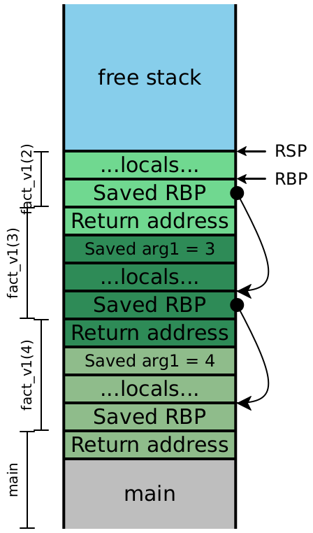

# kallsyms

## Introduction

Linux Kernel에서는 문제 발생 지점에 대한 정보를 제공하기 위해, oops 또는 panic이 발생했을 때 각 레지스터에 들어있는 값과 call trace 등 다양한 정보를 제공합니다.

예를 들어 아래와 같이 stack이 구성되어 있고, B 실행 중에 panic이 발생했다고 가정해봅시다.

```
+-------------------------------+
|   B에서 사용하는 지역 변수들    |
|                               |
+-------------------------------+
|            B의 SFP            |
+-------------------------------+
|            B의 RET            |
+-------------------------------+
|   A에서 사용하는 지역 변수들    |
|                               |
+-------------------------------+
|            A의 SFP            |
+-------------------------------+
|            A의 RET            |
+-------------------------------+
|  main에서 사용하는 지역 변수들  |
|                               |
+-------------------------------+
|          main의 SFP           |
+-------------------------------+
|          main의 RET           |
+-------------------------------+
```

oops 혹은 panic이 발생하면, 여러가지 fault 처리 함수를 거쳐 최종적으로 register 상태와 call trace를 출력하는 `show_trace_log_lvl()` 함수가 호출됩니다. 그리고 `show_trace_log_lvl()` 함수는 call trace를 복원하기 위해 stack frame에 맞추어 파싱합니다. 

`show_trace_log_lvl()`에서 call trace를 구하는 방법을 더 자세히 알아봅시다. x86-64 architecture에서 stack frame은 아래와 같이 saved rbp(a.k.a. stack frame pointer)가 linked list처럼 연결되어 있고, 함수가 종료되고 돌아갈 return address는 saved rbp 바로 아래에 위치합니다.



[1] 

따라서 oops 혹은 panic이 발생한 함수의 rbp 부터 차례대로 stack을 순회하면 각 함수의 return address를 알 수 있게 되고, 따라서 call trace도 복원할 수 있게 됩니다. 그런데 stack에는 return address만 존재하지 그 주소가 어떤 함수의 어떤 부분인지에 대한 정보는 전혀 나와있지 않습니다. 하지만 linux kernel에서는 oops 혹은 panic이 발생할 때 call trace가 아래와 같이 주소만 출력하는 것이 아닌 주소에 해당하는 함수까지 출력됩니다. 어떻게 이 주소에 해당하는 함수를 알아낸 것일까요?
```
Call Trace:
 [<ffffffff8100dead>] panic+0xdead
 [<ffffffff8100bbbb>] B+0xbb
 [<ffffffff8100aaaa>] A+0xaa
 [<ffffffff81001234>] main+0x11
```

정답은 바로 kallsyms를 이용하는 것입니다. kallsyms는 커널의 symbol 정보를 압축해서 저장하며, 함수 뿐만 아니라 전역변수(`CONFIG_KALLSYMS_ALL`이 활성화된 경우)애 대한 정보 또한 가지고 있습니다. kallsyms가 정확히 어떻게 동작하는지는 아래에서 더 자세히 알아보겠습니다.


# 출처 및 참고 문헌
[1] https://course.ccs.neu.edu/cs4410sp20/lec_tail-calls_x64_notes.html 